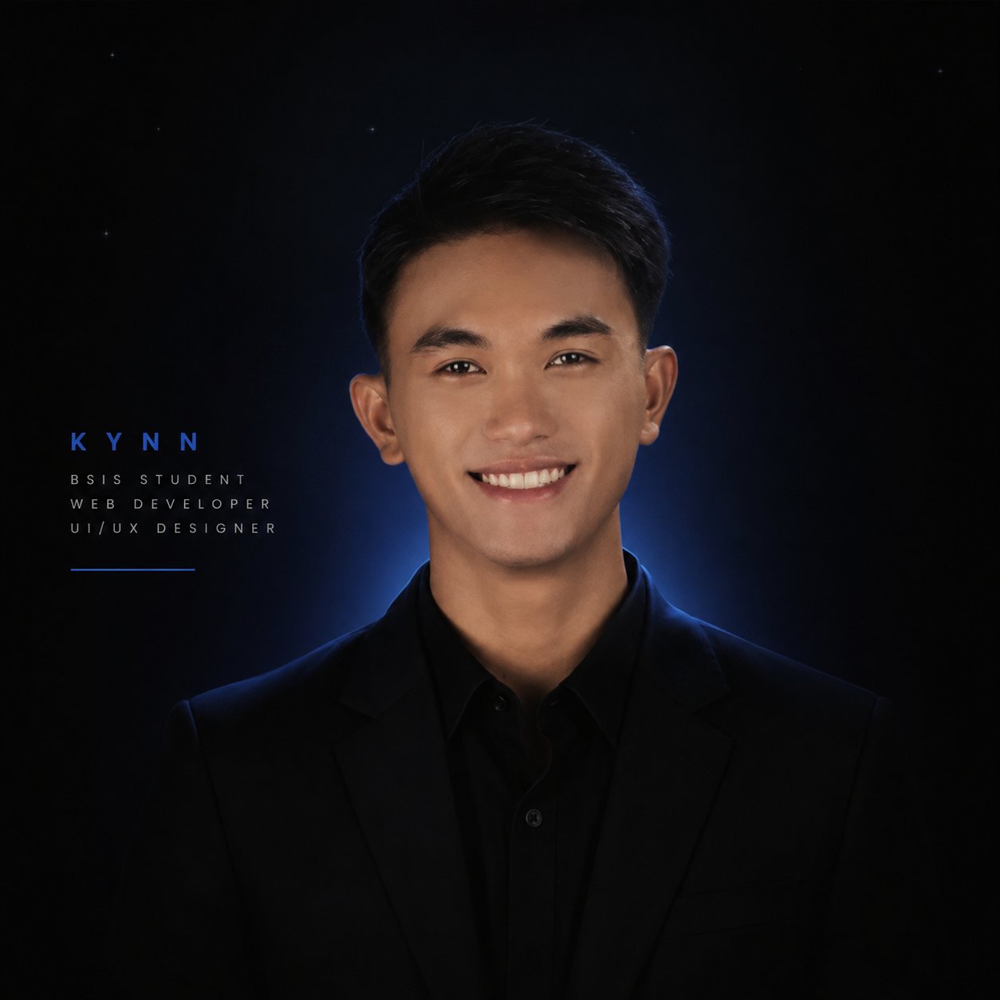

<table>
<tr>
<td width="30%" valign="top" align="center">

# Kynn Joriss D. Bulay-og

🎓 2nd-Year BSIS Student

📍 Panabo City, Davao del Norte, Philippines

💻 Aspiring System Developer

🎨 Visual Artist & Graphic Designer

🌐 Web Developer

---

### Connect

🌐 Portfolio

https://kynncreate.framer.website/

🌐 Email

jorisskynn@gmail.com
</td>

<td width="70%" valign="top">

# 👋 Hi there, I'm Kynn Joriss D. Bulay-og

### 2nd-Year Bachelor of Science in Information Systems (BSIS) Student

💻 Aspiring System Developer &nbsp; | &nbsp;
🎨 Visual Artist & Graphic Designer &nbsp; | &nbsp;
🌐 Web Developer

---

## 👨‍💻 About Me

I'm a 2nd-Year Bachelor of Science in Information Systems (BSIS) student at Davao del Norte State College from Panabo City, Davao del Norte, Philippines.

Motivated and adaptable BSIS student with knowledge in programming, web development, and information systems. Strong problem-solving, teamwork, and communication skills with experience in academic and business-related projects.

Beyond technology, I also work in visual arts and graphic design, creating posters, branding materials, digital artwork, and creative media that combine aesthetics with functionality.

I am eager to gain professional experience and contribute effectively in a dynamic work environment.

---

## 🛠 Skills

---

## 🚀 Featured Projects

### 🌱 EcoServe
Environmental feedback and management platform focused on sustainability and community engagement.

### 🎨 Women of Mindanao Poster Campaign
Advocacy-driven visual design project highlighting women's economic contributions and invisible labor.

### 🌐 Personal Portfolio
A professional portfolio showcasing my projects, skills, graphic designs, and development journey.

🔗 https://kynncreate.framer.website/

---
### 🏆 Achievements
- Graduated with honor at Father Saturnino Urios College of Trento Inc.
- Created collaborative film
- Designed visual graphics
---
### 🎯 Interests
- Visual Arts
- Graphic Designing
- Creating Film
- System Designing
---
### 📫 Connect With Me
- ⓕ Facebook: https://www.facebook.com/share/1ApSzGVHYr/
- 💼 LinkedIn: www.linkedin.com/in/kynn-joriss-bulay-og-b32b1040b
- 🌐 Portfolio: https://kynncreate.framer.website/
---

> "Creativity meets technology to solve problems and create meaningful experiences."

</td>
</tr>
</table>
